# STO-CLARE — the manual

STO-CLARE reads the combat log Star Trek Online writes while you play and turns
it into tables and charts: how much damage you dealt, how much you took, what
each of your abilities contributed, who healed whom, and how one run compares to
another. This manual walks through every part of the program. If you have not
installed it yet, start with the [README](README.md).

The program never touches the game. It only reads a text file the game writes,
so nothing you do here can affect your account or your build.

---

## Before you start

Two things have to be true before any numbers appear:

1. Combat logging is switched on in the game. Type `/Combatlog 1` into the chat
   window and press Enter. **This has to be done again after every login.**
2. STO-CLARE knows where the log file is. That is the one setting you must fill
   in yourself — see [Settings → General](#general).

Then fight something, and press **Refresh Now**.

---

## The main window

Everything lives in one window. From top to bottom:

```
┌─ STO-CLARE ─────────────────────────────────────────────────────────┐
│ Settings  Records  Compare Combats                     ← top row    │
├─────────────────────────────────────────────────────────────────────┤
│ [combat you are reading ▼]  Combats  Refresh Now  Clear Log File    │
│ Auto Refresh  Save Combat  Upload  Copy Combat Summary  Overlay     │
│ Show only: [type ▼] [level ▼] [map ▼]                  ← filters    │
├─────────────────────────────────────────────────────────────────────┤
│ Summary │ Damage Dealt │ Damage Taken │ Self Healing │ …  ← tabs    │
├─────────────────────────────────────────────────────────────────────┤
│                                                                     │
│   the table for the tab you picked                                  │
│                                                                     │
├─────────────────────────────────────────────────────────────────────┤
│   charts for the rows you selected                                  │
└─────────────────────────────────────────────────────────────────────┘
```

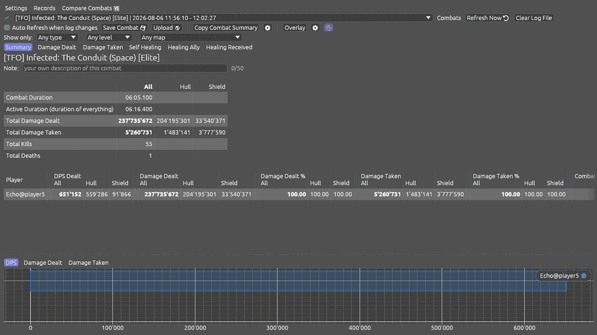

---

## Picking a combat

### The combats list

The wide drop-down at the top holds every combat found in your log, newest
first. Pick one and every tab below fills in with it.

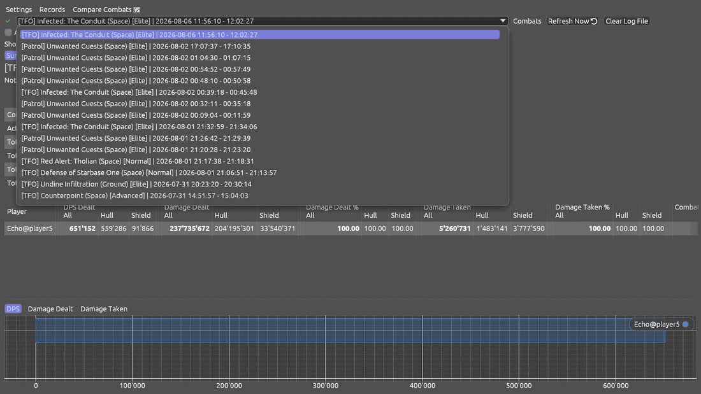

Each entry reads: map name, whether it was space or ground, the difficulty, and
the time it started and ended — for example
`[TFO] Infected: The Conduit (Space) [Elite] | 11:56:10 - 12:02:27`. The map and
difficulty are worked out from what happened in the fight, so you do not have to
name anything yourself.

Tip: a fight that ran long can end up split across two entries. If the numbers
look far too low, check the neighbouring entry.

### Narrowing the list

The three menus under the toolbar — type, level and map — cut the list down.
Each menu only offers what the other two leave reachable, so you cannot pick a
combination that shows nothing. A **Clear filter** button appears once any of
them is set.

### Describing a combat so you can find it again

A list of runs on the same map, all called the same thing and told apart only by
a timestamp, is hard to read a week later. So every combat can be given a short
description of your own.

1. Pick the combat in the list.
2. Click the **Note** field under the tabs — it sits right below the combat's
   title.
3. Type up to 50 characters: "new build", "no buffs", "rainbow boat", whatever
   tells you what that run was.

There is nothing to save. The description is kept with your settings and stays
with that combat, and it shows up **in the combats list itself**, after a dash:

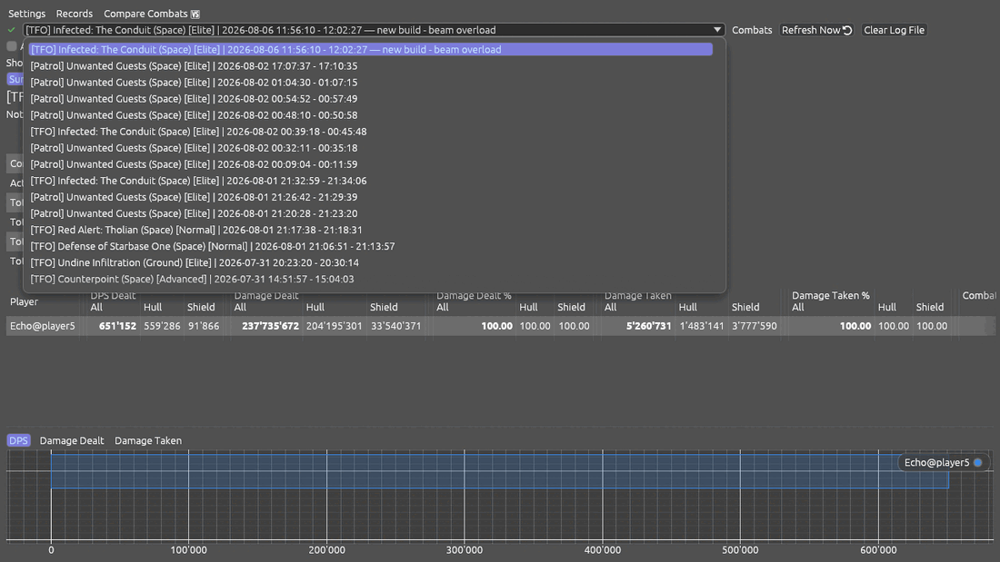

The counter next to the field (`0/50`) tells you how much room is left. Clearing
the text removes the description again.

Tip: this pairs with **Compare Combats** — label two runs before comparing them,
and you can tell at a glance which column is which build.

### The buttons around the list

| Button                        | What it does                                                                                                                   |
|-------------------------------|--------------------------------------------------------------------------------------------------------------------------------|
| Refresh Now                   | Re-reads the log and picks up combats fought since you last looked.                                                            |
| Auto Refresh when log changes | Keeps the list and the numbers current by itself while you play.                                                               |
| Save Combat                   | Writes the selected combat to a log file of its own, so you can keep or share it.                                              |
| Clear Log File                | Opens a list of every combat with tick boxes, and deletes only the ones you tick. Everything but the newest is ticked for you. |
| Copy Combat Summary           | Puts a short text summary on your clipboard, ready to paste into the game chat.                                                |
| Upload                        | Sends the combat to the OSCR ladder — see [Uploading](#uploading-to-the-oscr-ladder).                                          |
| Overlay                       | Opens the small always-on-top window — see [The overlay](#the-overlay).                                                        |

---

## Reading one combat

### Summary

The Summary tab answers "how did this run go" in one screen: how long the fight
lasted, total damage dealt and taken, kills and deaths, and a row per player
with their DPS and totals.

Most numbers are split into **All**, **Hull** and **Shield** columns, so you can
see how much of a figure landed on hull and how much was eaten by shields. If
you prefer the compact table, turn the split off under
[Settings → General](#general).

### Damage Dealt

One row per player, ordered by damage. This is where you find your DPS.

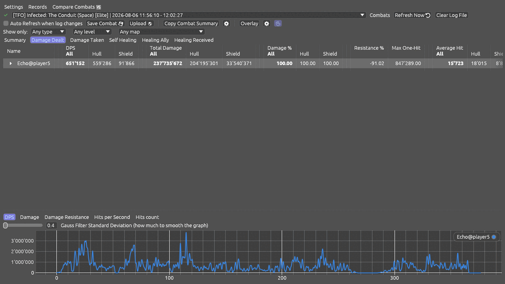

Click the little triangle at the start of a row and it opens up into everything
that player used, ordered by contribution:

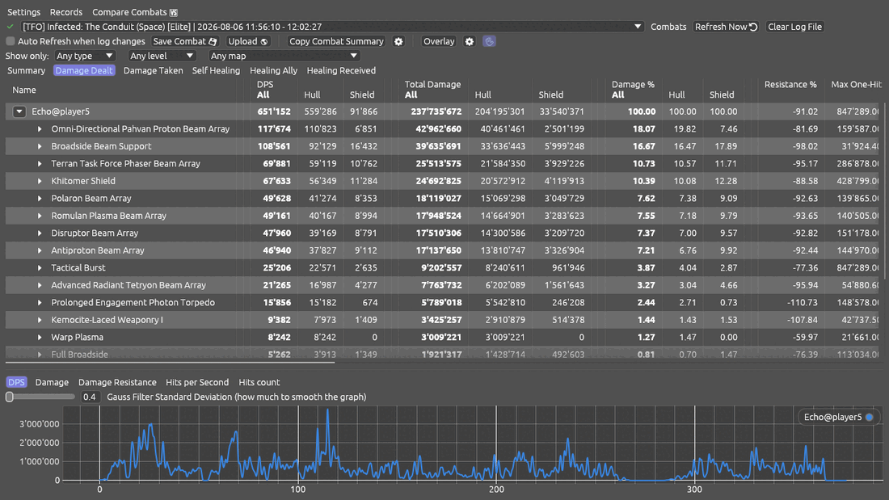

Read across the columns for one ability:

| Column       | What it tells you                                                                                             |
|--------------|---------------------------------------------------------------------------------------------------------------|
| DPS          | Damage per second that ability contributed over the whole fight.                                              |
| Total Damage | Everything it dealt, hull and shield.                                                                         |
| Damage %     | Its share of that player's damage. Useful for spotting what is actually carrying your build.                  |
| Resistance % | How much of the target's hull soaked the hit up. A negative number means you were cutting through resistance. |
| Max One-Hit  | The single biggest hit it landed.                                                                             |
| Average Hit  | What a typical hit did.                                                                                       |

Rows can be opened further where an ability has parts underneath it — a console
that spawns something, a pet, an anomaly.

### Damage Taken

The same table, for what was done to you: what hit you, how hard, and how much
your shields absorbed.

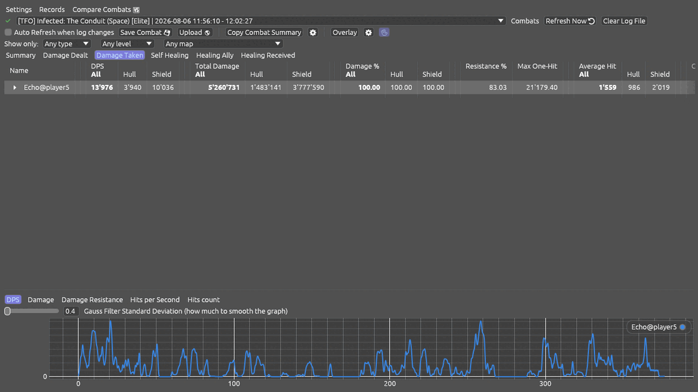

### The three healing tabs

Healing is split into three tabs that never count the same heal twice:

| Tab              | What it holds                    |
|------------------|----------------------------------|
| Self Healing     | What you healed on yourself.     |
| Healing Ally     | What you healed on other people. |
| Healing Received | What other people healed on you. |

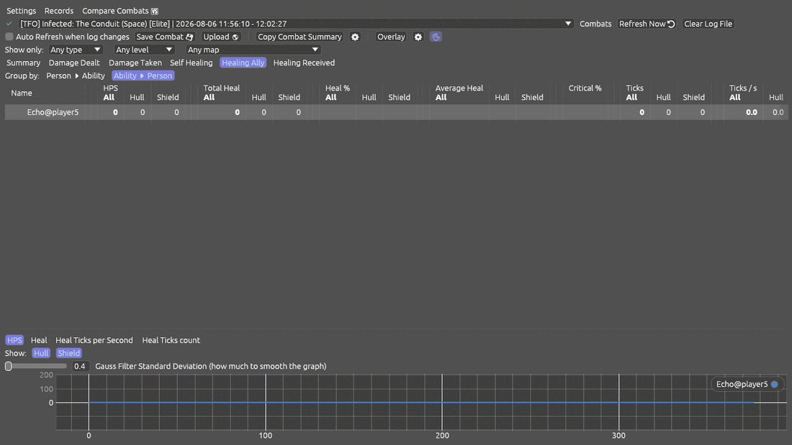

This split matters: on a normal run one gear proc healing you can be most of
your healing number, and if that is mixed in with what you did for the team, it
buries everything the team actually did.

### The charts

The strip along the bottom follows whatever rows you have selected in the table.
Its own tabs pick what is drawn — DPS, damage, damage resistance, hits per
second, hit counts — and the slider smooths the line so a spiky graph becomes
readable.

Select an ability in the table above and the chart follows it, so you can see
when in the fight it was actually doing something.

---

## Comparing combats

**Compare Combats** in the top row puts up to three runs side by side. First
tick the ones you want:

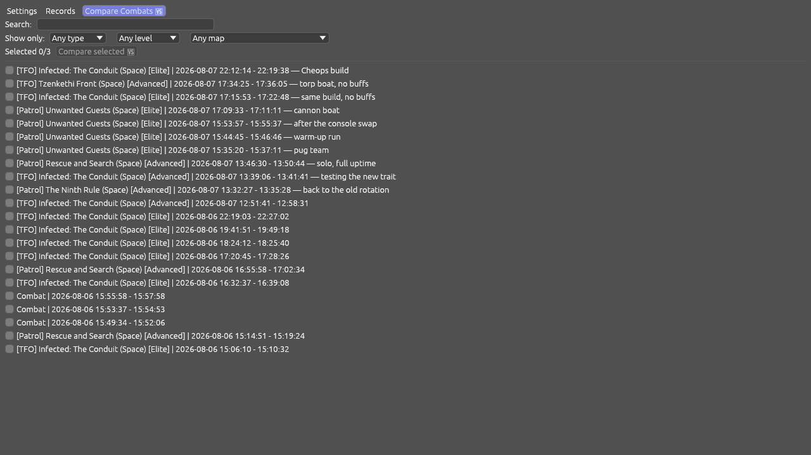

Then press **Compare selected**:

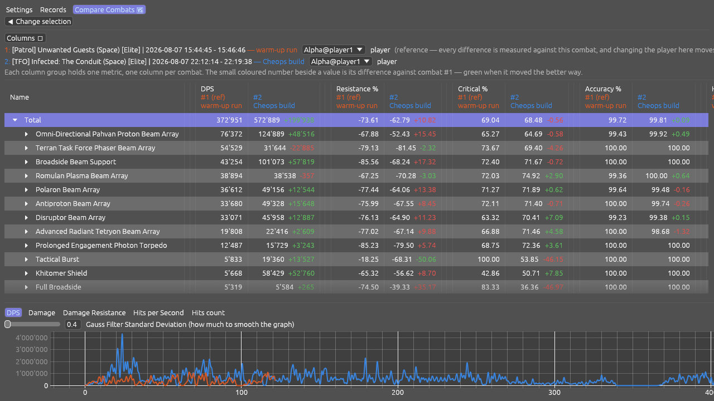

The first combat you ticked is the reference. Every other combat gets a small
coloured number next to each value: green when it moved the better way, red when
it moved the worse way. The ability breakdown is lined up group by group, so you
are comparing the same ability across runs rather than reading two lists.

The **Columns** menu decides which metrics are shown. All of the compared
combats open on the same player, so you are looking at one player's runs rather
than several people's.

Tip: a DPS difference on its own can hide what changed — firing more often while
each hit lands softer can come out looking like nothing happened. Switch the
breakdown on in the Columns menu and each difference is split into the part that
came from landing hits more often and the part that came from each hit landing
harder. The two always add up to the whole difference.

---

## The overlay

**Overlay** opens a small always-on-top window that shows the newest combat
while you play. It always follows the newest fight, whatever combat you have
open in the main window.

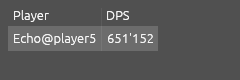

Two buttons sit on the overlay itself, along its bottom edge:

| Button | What it does                                                                                                                              |
|--------|-------------------------------------------------------------------------------------------------------------------------------------------|
| ⛭      | Picks which columns the overlay shows. DPS is on to begin with; tick as many more as you want to watch.                                   |
| ✋      | Lets you drag the overlay around. Switch it off again and the overlay stops taking mouse clicks, so it cannot get in the way of the game. |

Away from those two buttons the overlay ignores the mouse entirely, so you can
click straight through it at whatever is behind — the game included. Only when
you move the pointer onto the buttons does it start taking clicks again.

If the overlay opens with nothing but the word "Player" in it, it has not been
given a combat yet — press **Refresh Now** in the main window and it fills in.

### Seeing the game through it

The overlay can be made see-through, so it sits over the game without hiding a
chunk of it. Go to **Settings → Visuals** and drag **Overlay Opacity**: all the
way right is solid, all the way left is as faint as it goes. Only the overlay
changes; the main window stays as it is.

The figures themselves stay solid however faint you make the background, so you
can still read your DPS at a glance while the game shows through around it.

It never goes fully invisible, on purpose — you would have no way left to find
it and switch it off.

On Linux in a Wayland session this always works. Elsewhere it depends on your
desktop being able to draw see-through windows; if it cannot, the overlay simply
stays solid.

The overlay remembers where you put it and comes back there next time. It uses
the same colours as the main window.

On Linux in a Wayland session the overlay stays above the game even in full
screen. In an X11 session it opens as an ordinary always-on-top window, and
whether it stays above a full-screen game is up to your window manager — running
the game in windowed mode is the reliable answer there.

---

## Uploading to the OSCR ladder

**Upload** sends the selected combat to the OSCR ladder and shows you where the
run placed. **Records** in the top row browses the ladder itself: pick a season
and a table, and read the standings.

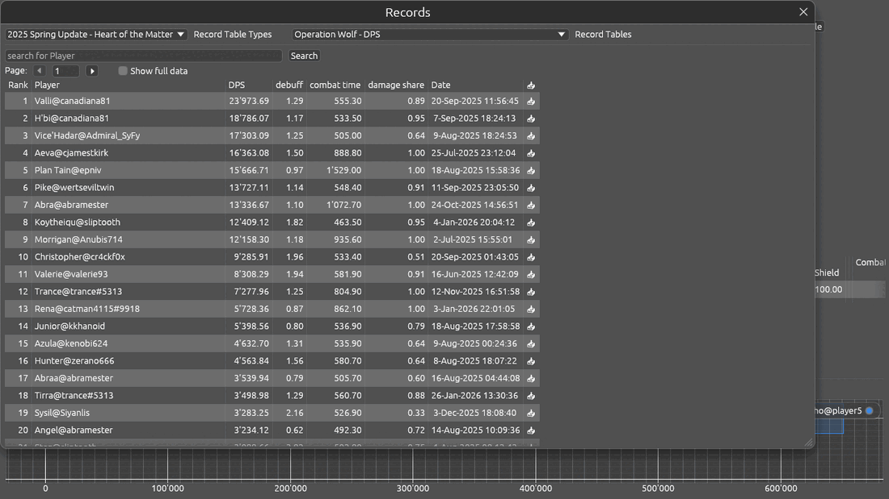

A combat can come back rejected, or uploaded but with no ladder entries. That
usually means the map and difficulty have no ladder for that period, or the
ladder only accepts solo runs.

---

## Settings

**Settings** is in the top row. Nothing is applied until you press **Ok** at the
bottom.

### General

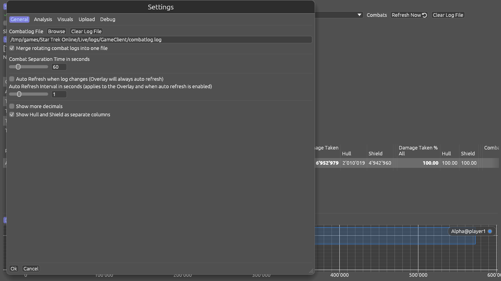

| Setting                                  | What it does                                                                                                                                                                                        |
|------------------------------------------|-----------------------------------------------------------------------------------------------------------------------------------------------------------------------------------------------------|
| Combatlog File                           | The path to the game's `combatlog.log`. Use **Browse** to find it; it sits in `<your STO installation>\Star Trek Online\Live\logs\GameClient\`.                                                     |
| Merge rotating combat logs into one file | If the game splits the log into many files, they are merged back into one so all your combats show up together. The originals are only removed once the merged file has been checked byte for byte. |
| Combat Separation Time                   | How long a lull has to last before the next fighting counts as a new combat.                                                                                                                        |
| Auto Refresh / interval                  | Whether the numbers keep themselves current, and how often.                                                                                                                                         |
| Show more decimals                       | More precision in the tables.                                                                                                                                                                       |
| Show Hull and Shield as separate columns | Off gives you the compact table, with hull and shield only in the hover box.                                                                                                                        |

### Analysis

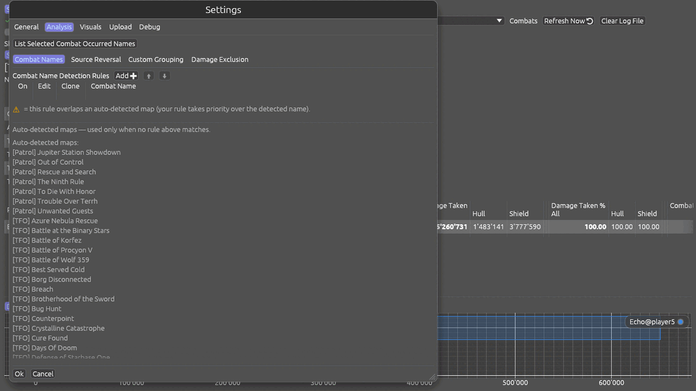

You do not need this section to read your damage. It changes how rows are named
and grouped.

| Tab              | What it is for                                                                                                                                                         |
|------------------|------------------------------------------------------------------------------------------------------------------------------------------------------------------------|
| Combat Names     | Your own rules for naming a combat. The list below the rules shows the maps recognised automatically, which is what is used when no rule of yours matches.             |
| Source Reversal  | Turns a group inside out: the effect on top and the pets or anomalies underneath, rather than the other way round. The Tachyon Net Drones console is the classic case. |
| Custom Grouping  | Folds several effects into one row — useful for a weapon with an extra proc, like the Advanced Piezo Beam Array and its Technical Overload.                            |
| Damage Exclusion | Leaves chosen damage out of the tables entirely.                                                                                                                       |

**Source reversal** in more detail: some damage and healing does not come
straight from you — pets, anomalies, consoles that spawn something. Those show
up as a row you can open, with the individual effects underneath. Sometimes you
want it the other way round: the effect on top, the pets underneath. That is
what a reversal rule does. The Tachyon Net Drones console is the classic case —
by default its effect is scattered over many rows, and one rule folds it into a
single row you can open. The settings ship with a ready-made example for the
starship trait Spore-Infused Anomalies; tick its "on" box to use it.

**Custom grouping** in more detail: a grouping rule folds several effects into
one row, which helps with a weapon that has an extra proc — the Advanced Piezo
Beam Array, whose Technical Overload fires alongside the beam itself. There is a
ready-made example for the Dark Matter Quantum Torpedo, again switched on with
its "on" box.

A warning mark next to one of your rules means it overlaps a map that would be
recognised automatically. Your rule still wins; the mark is only there so you
know why the name is not what you expected.

**List Selected Combat Occurred Names** shows every name that appeared in the
combat you are reading, which is the easy way to find the exact wording a rule
needs.

### Visuals

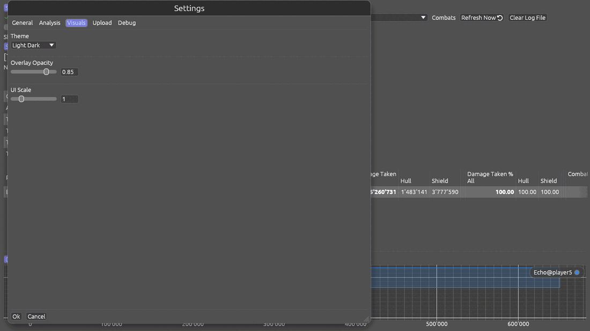

Pick a theme and set the interface scale. The scale is a multiplier — raise it
if the text is too small on a large screen. The themes are shown side by side in
the [README](README.md#themes).

**Colour-blind friendly chart colours** redraws the lines and bars of every
chart in a set of colours chosen to stay apart for red-green colour blindness,
which affects about one man in twelve. The ordinary set keeps neighbouring
series apart, but a chart with six or eight things on it can put two of them
side by side that look the same; this set is spaced out across the whole eight,
mostly by using light and dark rather than hue. Each theme has its own version,
so the colours still suit a dark or a light background.

Nothing else changes colour. The green and red differences in Compare and the
little status marks stay as they are — they already tell you which is which
without the colour, by the `+` or `-` in front of the number and by what the
mark says.

### Upload

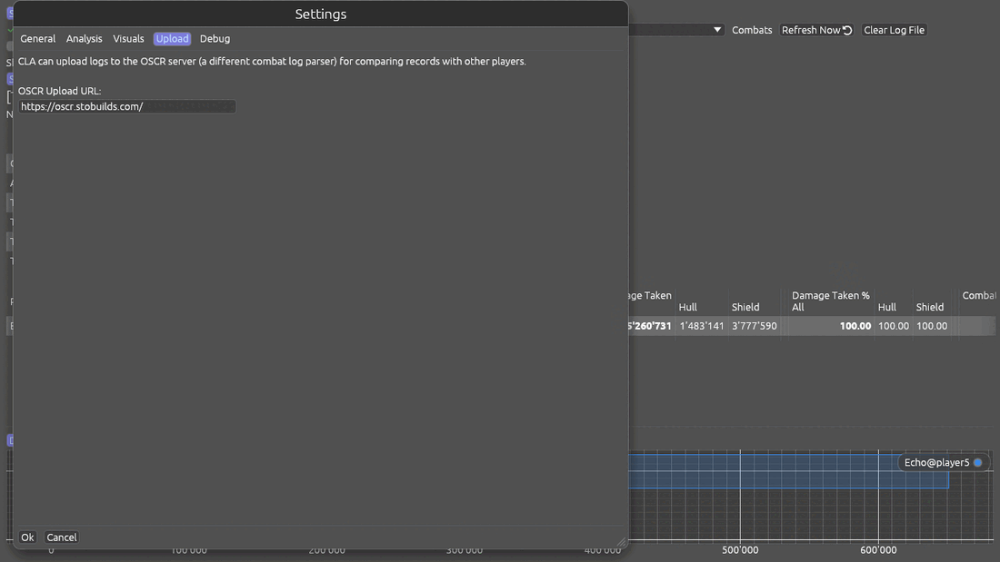

The address of the ladder server. Leave it alone unless you have been told to
change it.

### Debug

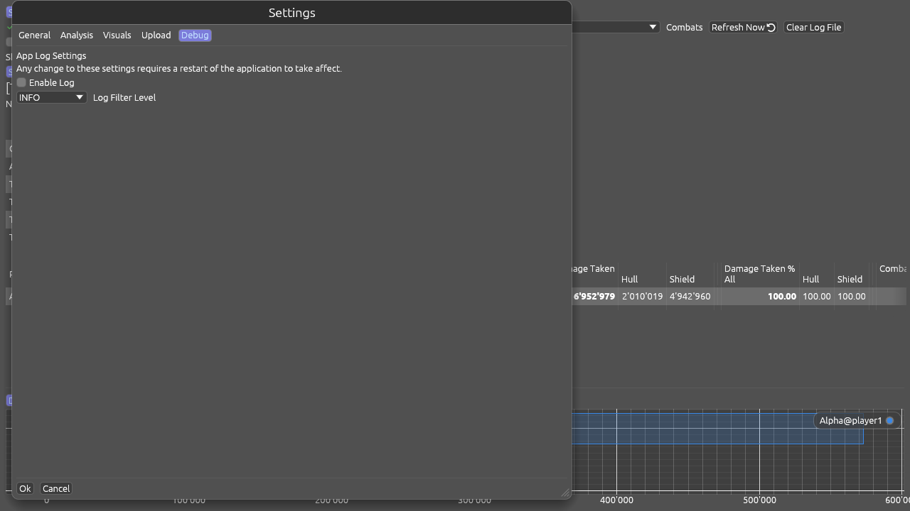

Writes a diagnostic log next to your settings. Leave it off unless you are
chasing a problem or someone has asked you for the file.

---

## Coming from the original STO_CombatLogAnalyzer

Your naming rules, grouping rules and every other setting can be carried over,
and the original program is left working. Which route you need depends on where
your old settings live.

**If you used an older version of this program** (anything before the rename),
there is nothing to do — your settings are picked up automatically the first
time STO-CLARE starts.

**If you used the original STO_CombatLogAnalyzer**, it keeps its settings in a
file named `STO_CombatLogAnalyzer_Settings.json`, sitting in the same folder as
the program itself. Copy it across by hand:

1. Find `STO_CombatLogAnalyzer_Settings.json` in the folder you run the original
   program from.
2. Copy it — do not move it — into the STO-CLARE settings folder:
   - Linux: `~/.config/STO-CLARE/`
   - Windows: `%APPDATA%\STO-CLARE\`
3. Rename the copy to exactly `STO-CLARE_Settings.json`.
4. Start STO-CLARE.

Everything arrives: the path to your combat log, the combat separation time,
your combat naming rules, your custom grouping and source reversal rules, the
theme and interface scale, and the ladder address. Sections that did not exist
in the original simply start at their defaults.

Because you copied rather than moved the file, your original installation is
untouched and keeps working if you want to go back to it.

Tip: if you happen to keep STO-CLARE in the same folder as the original program,
you can skip the renaming — the old file is found there and read once, then
written into the settings folder under the new name.

---

## Common situations

| If you want to…                      | Do this                                                     |
|--------------------------------------|-------------------------------------------------------------|
| See only Elite runs of one map       | Use the type, level and map menus under the toolbar.        |
| Find out what is carrying your build | Damage Dealt, open your row, read the Damage % column.      |
| Compare two runs of the same map     | Compare Combats, tick both, read the green and red numbers. |
| Watch your DPS while playing         | Open the Overlay; add more columns with ⛭.                  |
| Label a run so you find it later     | Type into the Note field under the tabs.                    |
| Share your numbers in chat           | Copy Combat Summary, then paste in the game.                |
| Keep one fight and clear the rest    | Clear Log File, untick the one you are keeping.             |
| See one ability over time            | Select its row; the charts at the bottom follow it.         |

## What can go wrong

| Symptom                                  | Likely cause                                                              | What to do                                                                                                 |
|------------------------------------------|---------------------------------------------------------------------------|------------------------------------------------------------------------------------------------------------|
| The combats list is empty                | Combat logging is off in the game                                         | Type `/Combatlog 1` in the game chat, fight something, press Refresh Now.                                  |
| Still empty after that                   | The path to the log is wrong                                              | Settings → General: the path must end in `combatlog.log`.                                                  |
| Only your newest fights show up          | The game split the log into several files                                 | On Linux, leave log merging switched on. On Windows, add `-NoAutoRotateLogs` to the game's launch options. |
| The overlay shows only the word "Player" | It has not been handed a combat yet                                       | Press Refresh Now in the main window.                                                                      |
| The overlay sits behind the game         | X11 session, or your window manager decided otherwise                     | Use a Wayland session, or run the game in windowed mode.                                                   |
| Numbers look far too low                 | The fight is split across two entries in the list                         | Check the neighbouring entry.                                                                              |
| A combat is named wrongly                | One of your own naming rules is matching first                            | Settings → Analysis → Combat Names; a warning mark shows which rule overlaps.                              |
| The upload produced no ladder entries    | That map and difficulty have no ladder for the period, or it is solo-only | Nothing to fix; the run is still uploaded.                                                                 |

## FAQ

**Q: Does this change anything in the game?**
A: No. It only reads a file the game writes.

**Q: Do I have to keep the program open while I play?**
A: No. The game writes the log whether or not STO-CLARE is running. Open it
afterwards and press Refresh Now. Keep it open only if you want the overlay or
live numbers.

**Q: Where are my settings kept?**
A: `~/.config/STO-CLARE` on Linux, `%APPDATA%\STO-CLARE` on Windows.

**Q: Why does one ability show as several rows?**
A: Some abilities write more than one kind of record — a beam and its proc, or a
console and the thing it spawns. A custom grouping rule folds them into one row;
see [Settings → Analysis](#analysis).

**Q: Can I start over?**
A: Delete the settings file from the folder above. The program writes a fresh
one with its defaults on the next start.

## Where to get more help

- Report a problem or ask a question in the
  [issue tracker](https://github.com/raman78/STO-CLARE/issues).
- Every release and what changed in it is listed in
  [CHANGELOG.md](CHANGELOG.md).
</content>
